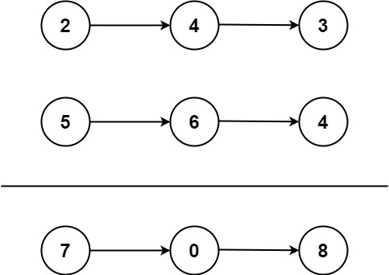

# Add Two Numbers 兩數相加

## 題目說明
給定兩個非空的鏈結串列（Linked List），整個串列可表示為一個非負整數。數字是以反序儲存的，每個節點只存放一個數字，且不會以0開頭。

將這兩個整數相加，並以相同的反序方式回傳結果的鏈結串列。

### 範例
- Input: l1 = [2,4,3], l2 = [5,6,4]

    Output: [7,0,8]
    
    Explanation: 342 + 465 = 807.

- Input: l1 = [0], l2 = [0]
    
    Output: [0]

- Input: l1 = [9,9,9,9,9,9,9], l2 = [9,9,9,9]

    Output: [8,9,9,9,0,0,0,1]

### 條件
- 每個鏈結串列的節點數範圍在 [1, 100] 之間
- 0 <= Node.val <= 9
- 不會有前導 0

## 解題思路
1. **迴圈加法**

    同時走訪兩個 Linked list，逐位相加，考慮進位（carry）再建立一個新的 linked list 存放結果。
    > Time Compelexity : O( $max(m, n)$ )，m, n分別為l1 及 l2 的長度  
    > Space Complexity : O(max(m, n))，(結果 linked list)  
    > Disadvantage: 程式碼較繁瑣且指標操作較多

2. 遞迴加法

    邏輯上與解法1相同，只是換成遞迴實作。
    每一層遞迴處理一位節點和 carry，回傳當前位數的節點，並遞迴處理下一位。終止條件是兩條 list 都為 null 且 carry = 0。
    注意：長度不同的 linked list，且需要額外處理 carry 的傳遞。
    > Time Compelexity : O( $max(m, n)$ )  
    > Space Complexity : O( $max(m, n)$ )，(結果 linked list) + O(max(m, n)) (呼叫的 stack 空間)  
    > Disadvantage: 遞迴太深時有 Stack Overflow 風險
    
### Key Concepts
- Linked List
- Pointer
- Recursion